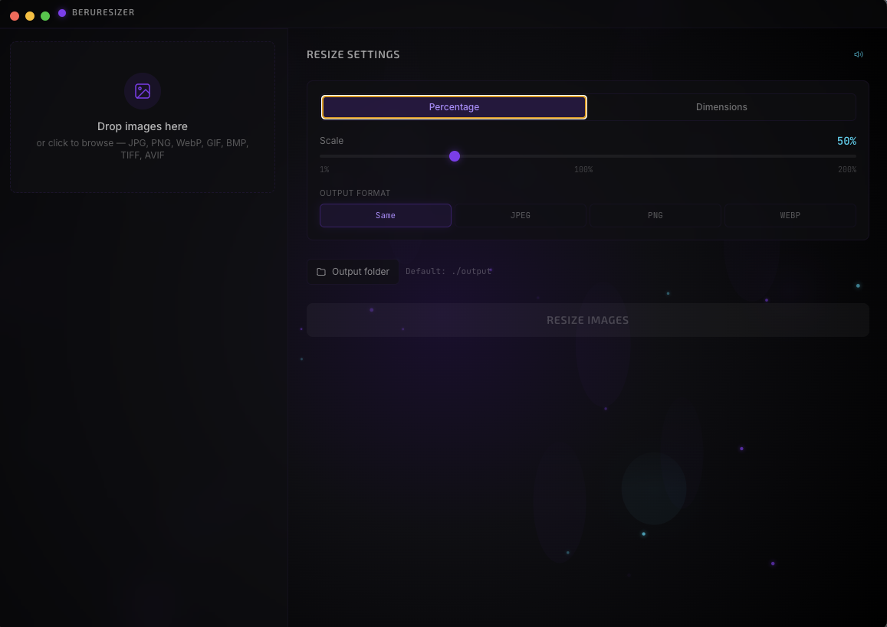

# BeruResizer

Application desktop de redimensionnement d'images batch.

Built with Electron + React + Sharp + TailwindCSS.



---

## Fonctionnalités

- **Drag & Drop** — Glisser-déposer des images directement dans l'application
- **Upload classique** — Sélection via le dialog natif de l'OS
- **Batch processing** — Traitement de plusieurs images simultanément
- **Resize par pourcentage** — Slider de 1% à 200%
- **Resize par dimensions** — Largeur × Hauteur en pixels
- **Verrouillage ratio** — Maintien automatique des proportions
- **Preview dimensions** — Aperçu en temps réel des dimensions finales
- **4 formats de sortie** — Original, JPEG, PNG, WebP
- **Dossier output configurable** — Par défaut `./output` à côté des images source
- **Affichage avant/après** — Taille fichier et dimensions avec % de réduction
- **Barre de progression animée** — Aura énergétique pendant le traitement
- **Son de complétion** — Effet sonore synthétique futuriste (désactivable)
- **Persistence des paramètres** — Sauvegarde automatique dans localStorage
- **Gestion d'erreurs** — Feedback visuel clair pour chaque image

## Formats supportés

| Entrée | Sortie |
|--------|--------|
| JPEG | JPEG |
| PNG | PNG |
| WebP | WebP |
| GIF | — |
| BMP | — |
| TIFF | — |
| AVIF | — |

---

## Prérequis

- **Node.js** >= 20.x
- **npm** >= 10.x
- **macOS**, **Windows** ou **Linux**

---

## Installation

```bash
git clone git@github.com:Jonathanlight/beru_resizer.git
cd beru_resizer
npm install
```

---

## Développement

Lance le serveur Vite + Electron en mode développement :

```bash
npm run dev
```

Cela exécute :
1. `vite` — Serveur de développement React sur `http://localhost:5173`
2. `wait-on` — Attend que le serveur soit prêt
3. `electron .` — Lance l'application Electron pointant vers le serveur Vite

---

## Build production

```bash
npm run build
```

Cela exécute :
1. `vite build` — Compile le renderer React dans `./dist`
2. `electron-builder` — Package l'application native dans `./release`

Les binaires générés se trouvent dans le dossier `release/` :

| Plateforme | Format |
|------------|--------|
| macOS | `.dmg` |
| Windows | `.exe` (NSIS installer) |
| Linux | `.AppImage` |

---

## Scripts disponibles

| Commande | Description |
|----------|-------------|
| `npm run dev` | Lancer en mode développement (Vite + Electron) |
| `npm run dev:vite` | Lancer uniquement le serveur Vite |
| `npm run dev:electron` | Lancer uniquement Electron (nécessite Vite actif) |
| `npm run build:vite` | Build du renderer React uniquement |
| `npm run build` | Build complet (renderer + package Electron) |
| `npm run preview` | Preview du build Vite |

## Stack technique

| Technologie | Usage |
|-------------|-------|
| [Electron](https://www.electronjs.org/) | Application desktop cross-platform |
| [React 18](https://react.dev/) | Interface utilisateur |
| [Vite](https://vitejs.dev/) | Bundler et serveur de développement |
| [Sharp](https://sharp.pixelplumbing.com/) | Traitement d'images haute performance |
| [TailwindCSS](https://tailwindcss.com/) | Styling utilitaire |
| [Framer Motion](https://www.framer.com/motion/) | Animations React |
| [electron-builder](https://www.electron.build/) | Packaging et distribution |

---

## Licence

MIT

## Author

- Jonathan Kablan
